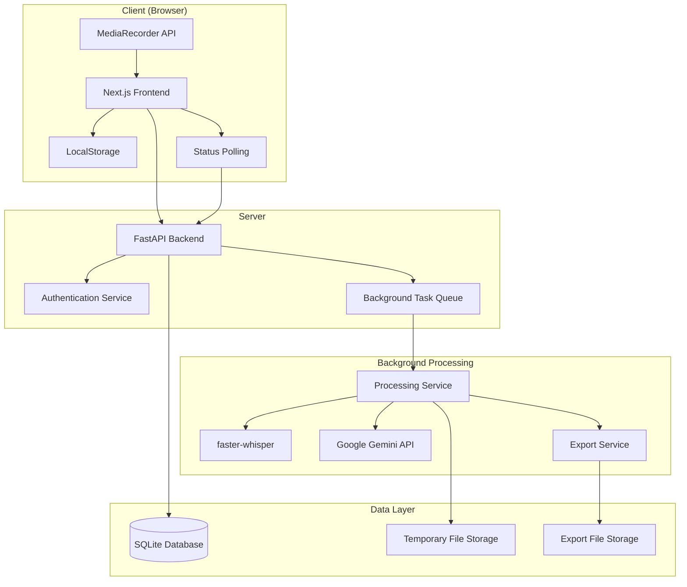

# Design Document

## Overview

The lecture-to-slides system is a web-based application that transforms recorded lectures into structured slide presentations. The system follows a modern, decoupled architecture with a Next.js frontend communicating with a FastAPI backend through REST APIs. The backend orchestrates AI services for transcription and content generation while managing data persistence.

The design prioritizes rapid development, cost-effectiveness, and modularity to support future scaling from developer build to production deployment.

## Architecture

### High-Level Architecture



### Technology Stack

**Frontend:**
- Next.js 14+ with App Router and TypeScript
- Tailwind CSS for styling
- Zustand for state management
- Native MediaRecorder API for audio capture

**Backend:**
- Python 3.11+ with FastAPI
- SQLAlchemy ORM with SQLite database
- Pydantic for data validation
- JWT for authentication

**AI Services:**
- faster-whisper for speech-to-text transcription
- Google Gemini API for content generation

## Components and Interfaces

### Frontend Components

#### Authentication Components
- `LoginForm`: Handles user login with .edu email validation
- `RegisterForm`: User registration with password hashing
- `AuthGuard`: Protects routes requiring authentication

#### Recording Components
- `AudioRecorder`: Manages MediaRecorder API integration
  - State management for recording status
  - Visual feedback for recording state
  - Audio blob creation and upload
- `RecordingSession`: Container for recording workflow
  - Session initialization and cleanup
  - Progress indicators during processing

#### Editing Components
- `SlideEditor`: Main editing interface
  - Slide navigation and preview
  - Inline text editing with auto-save
  - Draft restoration from localStorage
- `SlideCard`: Individual slide component
  - Editable title and content fields
  - Confidence highlighting for transcription
- `TranscriptViewer`: Display and edit raw transcript
  - Highlight low-confidence words
  - Manual correction interface

#### Dashboard Components
- `Dashboard`: User's lecture session overview
- `SessionList`: Display saved sessions with metadata
- `ExportOptions`: PDF and PPTX export interface

### Backend API Endpoints

#### Authentication Endpoints (`/auth`)
```python
POST /auth/register
- Body: {email: str, password: str}
- Validates .edu domain
- Returns: {access_token: str, token_type: str}

POST /auth/token
- Body: {username: str, password: str} (OAuth2 form)
- Returns: {access_token: str, token_type: str}
```

#### Lecture Processing Endpoints (`/lectures`)
```python
POST /lectures/process
- Headers: Authorization: Bearer {token}
- Body: multipart/form-data with audio file
- Returns: 202 Accepted {session_id: str, status: str, message: str}
- Note: Starts background processing, does not wait for completion

GET /lectures/{session_id}/status
- Headers: Authorization: Bearer {token}
- Returns: {status: str, progress?: int, error?: str}
- Status values: "pending", "processing", "completed", "failed"

GET /lectures/sessions
- Headers: Authorization: Bearer {token}
- Returns: List[LectureSession]

GET /lectures/{session_id}
- Headers: Authorization: Bearer {token}
- Returns: {session: LectureSession, slides: List[Slide]}
- Note: Only call after status endpoint returns "completed"
```

#### Slide Management Endpoints (`/slides`)
```python
PUT /slides/{slide_id}
- Headers: Authorization: Bearer {token}
- Body: {title?: str, content?: str}
- Returns: {slide: Slide}

POST /slides/{session_id}/export
- Headers: Authorization: Bearer {token}
- Body: {format: "pdf" | "pptx"}
- Returns: 202 Accepted {export_id: str, status: str}
- Note: Starts background export generation

GET /slides/export/{export_id}/status
- Headers: Authorization: Bearer {token}
- Returns: {status: str, download_url?: str, error?: str}
- Status values: "pending", "processing", "completed", "failed"
```

### AI Service Interfaces

#### Transcription Service
```python
class TranscriptionService:
    def transcribe_audio(self, file_path: str) -> TranscriptionResult:
        """
        Returns:
        - text: Full transcript
        - segments: List of segments with confidence scores
        - language: Detected language
        """
```

#### Content Generation Service
```python
class ContentGenerationService:
    def generate_slides(self, transcript: str) -> SlideGenerationResult:
        """
        Returns:
        - slides: List of slide objects with title and content
        - metadata: Generation statistics and confidence
        """
```

## Data Models

### Database Schema

#### User Model
```python
class User(Base):
    id: int (Primary Key)
    email: str (Unique, .edu validation)
    hashed_password: str
    created_at: datetime
    is_active: bool = True
```

#### LectureSession Model
```python
class LectureSession(Base):
    id: int (Primary Key)
    owner_id: int (Foreign Key -> User.id)
    title: str (Optional, defaults to timestamp)
    transcript: str (Full transcript text)
    audio_duration: int (Duration in seconds)
    processing_status: str (pending, processing, completed, failed)
    created_at: datetime
    updated_at: datetime
```

#### Slide Model
```python
class Slide(Base):
    id: int (Primary Key)
    session_id: int (Foreign Key -> LectureSession.id)
    slide_number: int
    title: str
    content: str (JSON array of bullet points)
    confidence_data: str (JSON with word-level confidence)
    created_at: datetime
    updated_at: datetime
```

### API Data Transfer Objects

#### Slide Data Structure
```typescript
interface SlideData {
  id: number;
  slide_number: number;
  title: string;
  content: string[];
  confidence_data?: {
    title_confidence: number;
    content_confidence: number[];
    low_confidence_words: string[];
  };
}
```

#### Session Data Structure
```typescript
interface SessionData {
  id: number;
  title: string;
  transcript: string;
  audio_duration: number;
  processing_status: 'pending' | 'processing' | 'completed' | 'failed';
  created_at: string;
  slide_count: number;
}
```

## Error Handling

### Frontend Error Handling
- **Network Errors**: Retry mechanism with exponential backoff
- **Authentication Errors**: Automatic redirect to login with session restoration
- **Validation Errors**: Inline form validation with clear error messages
- **Processing Errors**: User-friendly error messages with retry options

### Backend Error Handling
- **File Upload Errors**: Size and format validation with descriptive messages
- **AI Service Errors**: Graceful degradation and retry logic
- **Database Errors**: Transaction rollback and data consistency checks
- **Rate Limiting**: Implement rate limiting for AI service calls

### Error Response Format
```json
{
  "error": {
    "code": "TRANSCRIPTION_FAILED",
    "message": "Unable to process audio file",
    "details": "Audio quality too low for accurate transcription",
    "retry_possible": true
  }
}
```

## Testing Strategy

### Frontend Testing
- **Unit Tests**: Component testing with React Testing Library
- **Integration Tests**: API integration and user flow testing
- **E2E Tests**: Critical path testing with Playwright
- **Accessibility Tests**: WCAG compliance validation

### Backend Testing
- **Unit Tests**: Service layer and utility function testing
- **Integration Tests**: Database operations and API endpoint testing
- **AI Service Tests**: Mock AI services for consistent testing
- **Performance Tests**: Load testing for file upload and processing

### Test Data Management
- **Mock Audio Files**: Various quality levels and durations
- **Sample Transcripts**: Different lecture types and lengths
- **Test Users**: .edu email accounts for authentication testing

### Testing Priorities
1. **Core Functionality**: Audio upload, transcription, slide generation
2. **Data Persistence**: Save/load operations and data integrity
3. **Error Scenarios**: Network failures, invalid inputs, service outages
4. **Performance**: File size limits, processing timeouts
5. **Security**: Authentication, authorization, input validation

## Asynchronous Processing Flow

### Processing Workflow
1. **File Upload**: User uploads audio file via POST /lectures/process
2. **Immediate Response**: Server returns 202 Accepted with session_id and starts background processing
3. **Status Polling**: Frontend polls GET /lectures/{session_id}/status every 5-10 seconds
4. **Progress Updates**: Backend updates processing_status and optional progress percentage
5. **Completion**: When status returns "completed", frontend fetches final results via GET /lectures/{session_id}

### Background Task Management
- **Development Build**: Simple threading with concurrent.futures for background processing
- **Production Build**: Celery with Redis/RabbitMQ for robust task queue management
- **Task Persistence**: All task status stored in database for recovery after server restarts

### User Experience During Processing
- **Processing Page**: Dedicated UI showing progress with estimated completion time
- **Navigation Freedom**: Users can safely leave the processing page and return later
- **Notifications**: Optional browser notifications when processing completes
- **Error Recovery**: Clear error messages with retry options for failed processing

## File Storage and Lifecycle

### File Management Strategy
- **Upload Storage**: Temporary directory with unique UUID-based filenames
- **Processing**: Files remain in temporary storage during transcription and generation
- **Cleanup**: Automatic deletion of audio files within 24 hours of upload
- **Export Storage**: Generated PDF/PPTX files stored temporarily for 7 days before cleanup
- **Security**: All file operations use secure temporary directories with restricted permissions

### Storage Locations
- **Development**: Local filesystem with configurable temp directory
- **Production**: Cloud storage (AWS S3, Google Cloud Storage) with lifecycle policies
- **Database**: Only metadata and results stored, never raw audio files

## Configuration Management

### Environment Variables
```bash
# Database
DATABASE_URL=sqlite:///./lectures.db

# AI Services
GOOGLE_API_KEY=your_gemini_api_key_here
WHISPER_MODEL_SIZE=base

# Security
SECRET_KEY=your_jwt_secret_key_here
ACCESS_TOKEN_EXPIRE_MINUTES=30

# File Storage
TEMP_FILE_DIR=./temp_uploads
MAX_FILE_SIZE_MB=500
MAX_DURATION_MINUTES=120

# Processing
BACKGROUND_TASK_TIMEOUT=3600
CLEANUP_INTERVAL_HOURS=24
```

### Configuration Security
- **Development**: .env files with .gitignore protection
- **Production**: Environment variable injection via secret managers (AWS Secrets Manager, Azure Key Vault)
- **Validation**: Startup configuration validation to ensure all required variables are present
- **No Hardcoding**: All sensitive data managed through environment variables

## Performance Considerations

### File Size and Duration Limits
- Maximum audio file size: 500MB
- Maximum recording duration: 120 minutes
- Processing timeout: 50% of audio duration

### Optimization Strategies
- **Audio Compression**: Client-side compression before upload
- **Chunked Processing**: Break large files into smaller segments
- **Background Processing**: Asynchronous processing with status updates
- **Caching**: Cache transcription results and generated content

### Scalability Considerations
- **Database**: SQLite for development, PostgreSQL for production
- **File Storage**: Local storage for development, cloud storage for production
- **AI Services**: Rate limiting and quota management
- **CDN**: Static asset delivery optimization

## Security Considerations

### Authentication and Authorization
- JWT tokens with appropriate expiration times
- Secure password hashing with bcrypt
- .edu email domain validation
- Session management and logout functionality

### Data Protection
- Input validation and sanitization
- SQL injection prevention through ORM
- File upload security (type and size validation)
- HTTPS enforcement in production

### Privacy Considerations
- **Audio File Deletion**: Automatic secure deletion within 24 hours of processing completion
- **Transcript Encryption**: All transcript data encrypted at rest using AES-256
- **User Data Anonymization**: Optional anonymization features for sensitive content
- **FERPA Compliance**: Best-effort compliance for MVP with full compliance planned for production

### FERPA Compliance Notes
**Important**: Achieving full FERPA compliance is a major undertaking requiring specific architectural decisions, data handling policies, and potential audits. For the MVP, we will operate on a "best-effort" basis by ensuring:
- Data encryption at rest and in transit
- Secure deletion of personally identifiable information
- Access controls and audit logging
- User consent mechanisms

Full FERPA compliance will be a production-build goal requiring legal review and potential third-party audits.